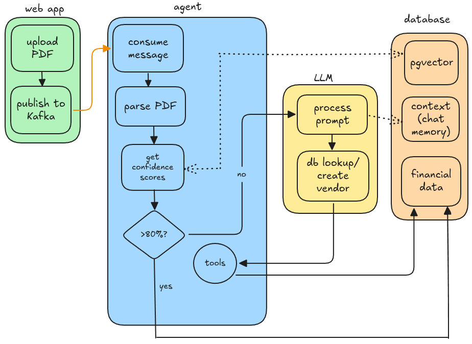

# finances-agent

The finances application has a statement upload feature which
does nothing more than upload the statement and publish a
Kafka message with the contents of the statement.


A separate microservice is required, which serves as a workflow with
one agentic decision point. It consumes the message, parses the PDF,
and communicates with the LLM to understand each transaction. The LLM
then leverages a tool to interact with the database, which ultimately
writes to stagings table.

Context is preserved in the database so that a restart or switch of LLM
preserves "memory". When this microservice starts, it hydrates the
vector database with the context from the database, so that the LLM can
leverage it when making decisions.

## Conceptual idea



## Design decisions

The diagram above is a simplified view of the workflow. Three LLM's
were tested:
- mistral
- qwen2.5:7b
- gemma4

Of the three, only gemma4 is multi-modal. This means it can accept more
than just text as input. Despite gemma4 being multi-modal, internally,
the PDF must first be rasterized. Commercial LLM's do this implicitly
without the user's knowledge, but it must be explicitly done here.

Both mistral and qwen2.5:7b were unable to understand how to identify
transactions. gemma4 was able to identify the first two transactions
correctly, and then it quickly hallucinated.

The undesired approach became unavoidable. For each statement type,
parsing and cleanup must be performed, and then clean data can then
be set as text to the LLM. While far from ideal, it's a great way
integrate all the underlying technology.

```shell
% curl -s http://llm:11434/api/tags | jq -r '.models[] | "\(.name)\t\(.capabilities | join(","))"'
gemma4:latest   completion,tools,thinking
qwen2.5:7b      completion,tools
mistral:latest  completion,tools
```

TODO:
- [ ] Get the prompt from the database that is specific to the statement that was uploaded.
- [ ] Need PostGreSQL to store context and questions.
- [ ] Need a vector database ... Neo4j? Or maybe just PostGreSQL with pgvector extension? 
